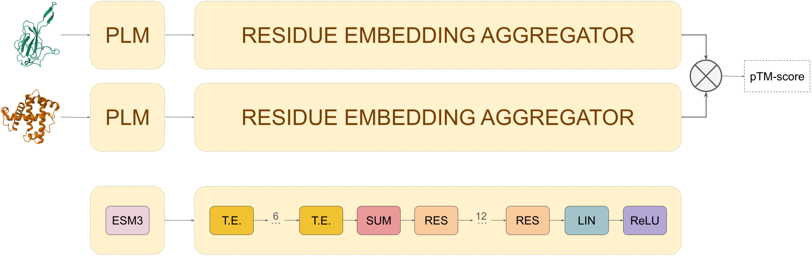

# RCSB Protein Structure Embedding Search

## Overview
This repository contains scripts to train a neural network model for protein structure search based on 3D structure embeddings.

Preprint: [Multi-scale structural similarity embedding search across entire proteomes](https://www.biorxiv.org/content/10.1101/2025.02.28.640875v1).

A web application implementing this method is available at [rcsb-embedding-search](http://embedding-search.rcsb.org).

If you are only interested in using the model for inference, visit the [rcsb-embedding-model repository](https://github.com/rcsb/rcsb-embedding-model), which provides a minimal setup.

---

## Embedding Model
The embedding model consists of two main components:

- **Protein Language Model (PLM)**: Computes residue-level embeddings from a given 3D structure.
- **Residue Embedding Aggregator**: A transformer-based neural network that aggregates these residue-level embeddings into a single vector.



### **Protein Language Model (PLM)**
Residue-wise embeddings of protein structures are computed using the [ESM](https://www.evolutionaryscale.ai/) generative protein language model.

### **Residue Embedding Aggregator**
The aggregation component consists of six transformer encoder layers, each with a 3,072-neuron feedforward layer and ReLU activations. Following these encoders, a summation pooling operation and 12 fully connected residual layers aggregate the resulting embeddings into a single 1,536-dimensional vector.

A pretrained Residue Embedding Aggregator model is available at [Hugging Face](https://huggingface.co/jseguramora/rcsb-embedding-model/resolve/main/rcsb-embedding-model.pt).

---

## Model Training
The embedding model was trained to predict the maximum TM-score between pairs of 3D structures. During training, the model operated as a twin neural network, utilizing shared weights to produce embeddings for pairs of 3D structures. ESM3 weights were frozen, and the aggregator network parameters were optimized to minimize the mean squared error (MSE) between cosine similarity and TM-score.

The training set was compiled by Chengxin Zhang and is available in this Zenodo [repository](https://zenodo.org/records/7324964). The dataset consists of 115 million SCOPe domain pairs with their corresponding TM-scores.

### **Training Process**
The embedding model can be trained using the script `src/training/embedding_tm_score.py`. Before training, ESM3 embeddings for the training set 3D structures must be precomputed.

```shell
python src/training/embedding_tm_score.py \
        --config-path=/config_folder \
        --config-name=training_config_file
```

### **Computing ESM3 Embeddings**
The script `src/scripts/esm3_embeddings_from_pdb.py` facilitates computing ESM3 embeddings for 3D structures:

```shell
python src/scripts/esm3_embeddings_from_pdb.py \
        --pdb_path /path_to_pdb_structures \
        --out_path /output_path
```

### **Training Configuration File**
Example training configuration file:

```yaml
computing_resources:
  devices: 1
  nodes: 1
  strategy: auto

training_set:
  batch_size: 2
  workers: 0
  tm_score_file: /<local_path>/<training_dataset_filename>.csv
  data_path: /<local_path>/<embedding-esm3>
  data_ext: pt
  
validation_set:
  batch_size: 2
  workers: 0
  tm_score_file: /<local_path>/<validation_dataset_filename>.csv
  data_path: /<local_path>/<embedding-esm3>
  data_ext: pt
  
training_parameters:
  learning_rate: 1e-5
  weight_decay: 0.
  warmup_epochs: 2
  epochs: 100
  check_val_every_n_epoch: 1
  epoch_size: 100000
  lr_frequency: 1
  lr_interval: epoch
  
embedding_network:
  _target_: networks.transformer_nn.TransformerEmbeddingCosine
  input_features: 1536
  nhead: 12
  num_layers: 6
  dim_feedforward: 3072
  hidden_layer: 1536
  res_block_layers: 12
```

---

## Inference
Embeddings for 3D structures can be calculated using the script `src/inference/embedding_inference.py`. ESM3 embeddings must be precomputed before inference.

```shell
python src/inference/embedding_inference.py \
        --config-path=/config_folder \
        --config-name=inference_config_file
```

### **Inference Configuration File**
Example inference configuration file:

```yaml
checkpoint: /<local_path>/<model>.ckpt

inference_writer:
  _target_: writer.batch_writer.CsvBatchWriter
  postfix: csv
  write_interval: batch
  output_path: /<output_path>

inference_set:
  embedding_source: /<local_path>/<inference_dataset_filename>.txt
  embedding_path: /<local_path>/<embedding-esm3>
  batch_size: 1
  workers: 0

embedding_network:
  _target_: networks.transformer_nn.TransformerEmbeddingCosine
  input_features: 1536
  nhead: 12
  num_layers: 6
  dim_feedforward: 3072
  hidden_layer: 1536
  res_block_layers: 12
```

---

## Questions & Issues
For any questions or comments, please open an issue on this repository.

---

## License
This software is released under the BSD 3-Clause License. See the full license text below.

### BSD 3-Clause License

Copyright (c) 2024, RCSB Protein Data Bank, UC San Diego

Redistribution and use in source and binary forms, with or without modification, are permitted provided that the following conditions are met:

1. Redistributions of source code must retain the above copyright notice, this list of conditions, and the following disclaimer.
2. Redistributions in binary form must reproduce the above copyright notice, this list of conditions, and the following disclaimer in the documentation and/or other materials provided with the distribution.
3. Neither the name of the copyright holder nor the names of its contributors may be used to endorse or promote products derived from this software without specific prior written permission.

THIS SOFTWARE IS PROVIDED BY THE COPYRIGHT HOLDERS AND CONTRIBUTORS "AS IS" AND ANY EXPRESS OR IMPLIED WARRANTIES, INCLUDING, BUT NOT LIMITED TO, THE IMPLIED WARRANTIES OF MERCHANTABILITY AND FITNESS FOR A PARTICULAR PURPOSE ARE DISCLAIMED. IN NO EVENT SHALL THE COPYRIGHT HOLDER OR CONTRIBUTORS BE LIABLE FOR ANY DIRECT, INDIRECT, INCIDENTAL, SPECIAL, EXEMPLARY, OR CONSEQUENTIAL DAMAGES (INCLUDING, BUT NOT LIMITED TO, PROCUREMENT OF SUBSTITUTE GOODS OR SERVICES; LOSS OF USE, DATA, OR PROFITS; OR BUSINESS INTERRUPTION) HOWEVER CAUSED AND ON ANY THEORY OF LIABILITY, WHETHER IN CONTRACT, STRICT LIABILITY, OR TORT (INCLUDING NEGLIGENCE OR OTHERWISE) ARISING IN ANY WAY OUT OF THE USE OF THIS SOFTWARE, EVEN IF ADVISED OF THE POSSIBILITY OF SUCH DAMAGE.

